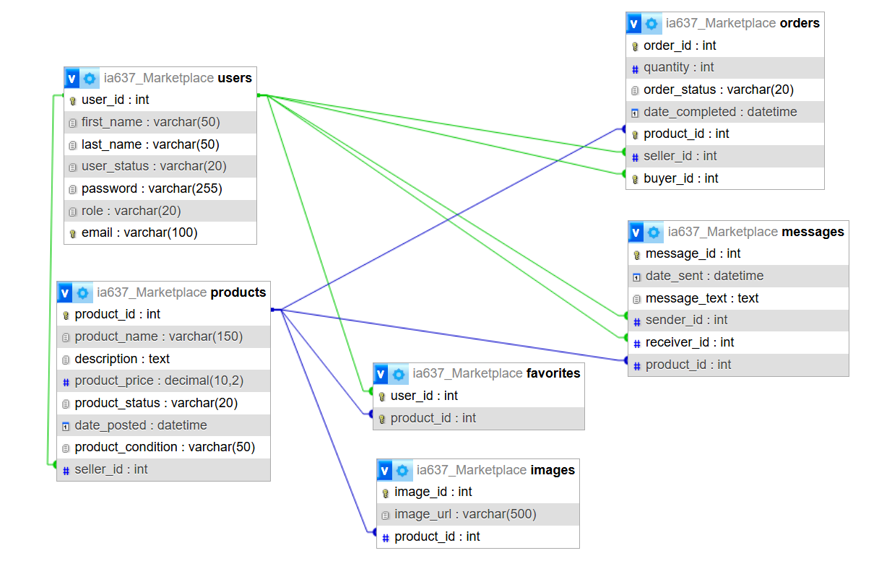

# CAMPUS MARKETPLACE
## Description
Our project is a campus marketplace app designed for students to easily buy, sell, and share items within their university community.
The app allows users to create accounts, list items (like textbooks, electronics or dorm essentials) and browse listings posted by other students. Each user can act as both a buyer and a seller, making it a flexible peer-to-peer platform. Core features include posting products with details (price, description, category), messaging between users and managing listings.
## Group Members
- Esuyawkal Bereda
- Kuda Anderson
## User Credential & Installation Instructions
- Clone the Repository
- Take the config.example and add your own credentials
- In the DB which you have created import the ia637_Marketplace_sql_init.sql file
- The sql file has the data populated in it too
- The user password with their role is written below

| # | User Type | Email | Password |
|---|------------|------------|-----|
| 1 | Admin | esuyawkal@clarkson.edu | 123 |
| 2 | Participant | kuda@clarkson.edu | 1234 |
## Relational Schema

## Analytical Queries
Some of the analytical queries used in handling order statistics
| # | Query Name | Description | SQL |
|---|------------|------------|-----|
| 1 | Total Revenue by Seller | Calculates total realized revenue for a seller (completed orders) | ```sql SELECT SUM(p.product_price * o.quantity) AS total_realized_revenue FROM orders o JOIN products p ON o.product_id = p.product_id WHERE o.order_status = 'completed' AND o.seller_id = ?; ``` |
| 2 | Total Revenue by Product | Calculates total revenue generated by a product | ```sql SELECT SUM(p.product_price * o.quantity) AS total_realized_revenue FROM orders o JOIN products p ON o.product_id = p.product_id WHERE o.order_status = 'completed' AND o.product_id = ?; ``` |
| 3 | Pending Revenue by Seller | Calculates total pending revenue for a seller | ```sql SELECT SUM(p.product_price * o.quantity) AS total_pending_revenue FROM orders o JOIN products p ON o.product_id = p.product_id WHERE o.order_status = 'pending' AND o.seller_id = ?; ``` |
| 4 | Check User Ordered Product | Checks if a user has already ordered a product | ```sql SELECT COUNT(*) AS count FROM orders WHERE buyer_id = ? AND product_id = ?; ``` |
| 5 | Buyer Order Stats | Shows total orders, completed, pending, and spending for a buyer | ```sql SELECT COUNT(*) AS buyer_total_orders, COUNT(CASE WHEN LOWER(o.order_status) = 'completed' THEN 1 END) AS buyer_completed_orders, COUNT(CASE WHEN LOWER(o.order_status) = 'pending' THEN 1 END) AS buyer_pending_orders, COUNT(CASE WHEN LOWER(o.order_status) NOT IN ('completed','pending') THEN 1 END) AS buyer_other_orders, ROUND(COALESCE(SUM(p.product_price * o.quantity),0),2) AS buyer_total_spend, ROUND(COALESCE(SUM(CASE WHEN LOWER(o.order_status)='completed' THEN p.product_price * o.quantity END),0),2) AS buyer_completed_spend, ROUND(COALESCE(SUM(CASE WHEN LOWER(o.order_status)='pending' THEN p.product_price * o.quantity END),0),2) AS buyer_pending_spend FROM orders o JOIN products p ON o.product_id = p.product_id WHERE o.buyer_id = ?; ``` |
| 6 | Seller Sales Stats | Shows sales performance metrics for a seller | ```sql SELECT COUNT(*) AS seller_total_sales, COUNT(CASE WHEN LOWER(o.order_status)='completed' THEN 1 END) AS seller_completed_sales, COUNT(CASE WHEN LOWER(o.order_status)='pending' THEN 1 END) AS seller_pending_sales, COUNT(CASE WHEN LOWER(o.order_status) NOT IN ('completed','pending') THEN 1 END) AS seller_other_sales, ROUND(COALESCE(SUM(p.product_price * o.quantity),0),2) AS seller_total_sales_value, ROUND(COALESCE(SUM(CASE WHEN LOWER(o.order_status)='completed' THEN p.product_price * o.quantity END),0),2) AS seller_completed_revenue, ROUND(COALESCE(SUM(CASE WHEN LOWER(o.order_status)='pending' THEN p.product_price * o.quantity END),0),2) AS seller_pending_revenue, ROUND(COALESCE(AVG(p.product_price * o.quantity),0),2) AS seller_avg_sale_value, ROUND(COALESCE(MAX(p.product_price * o.quantity),0),2) AS seller_largest_sale FROM orders o JOIN products p ON o.product_id = p.product_id WHERE p.seller_id = ?; ``` |
| 7 | Combined Buyer & Seller Stats | Aggregates both buyer and seller insights in one query | ```sql SELECT COUNT(CASE WHEN o.buyer_id = ? THEN 1 END) AS buyer_total_orders, COUNT(CASE WHEN o.buyer_id = ? AND LOWER(o.order_status)='completed' THEN 1 END) AS buyer_completed_orders, COUNT(CASE WHEN o.buyer_id = ? AND LOWER(o.order_status)='pending' THEN 1 END) AS buyer_pending_orders, COUNT(CASE WHEN p.seller_id = ? THEN 1 END) AS seller_total_sales, COUNT(CASE WHEN p.seller_id = ? AND LOWER(o.order_status)='completed' THEN 1 END) AS seller_completed_sales, COUNT(CASE WHEN p.seller_id = ? AND LOWER(o.order_status)='pending' THEN 1 END) AS seller_pending_sales, ROUND(COALESCE(SUM(CASE WHEN p.seller_id = ? THEN p.product_price * o.quantity END),0),2) AS seller_total_revenue FROM orders o JOIN products p ON o.product_id = p.product_id WHERE o.buyer_id = ? OR p.seller_id = ?; ``` |
## Users (Use Case)
1. Admin
    - View and manage all users
    - ban user accounts
    - View, edit, or delete any listing
    - Monitor platform activity
    - Handle user reports and complaints
    - Remove inappropriate or fraudulent content
    - Mark listings as unavailable and pending review
2. Participant
    i. Buyer
    - Create and manage their account
    - Browse and search for items
    - View item details (price, description, seller info)
    - Message sellers
    - Save or favorite listings
    - view past orders
    <!-- - Mark items as purchased (optional, depending on design) -->
    ii. Seller
    - Create and manage their account
    - Create new listings (add title, description, price, category)
    - Edit or delete their listings
    - Mark items as sold
    - View their active and past listings(up to a certain period)
    - Message buyers
    - Respond to inquiries about their items
